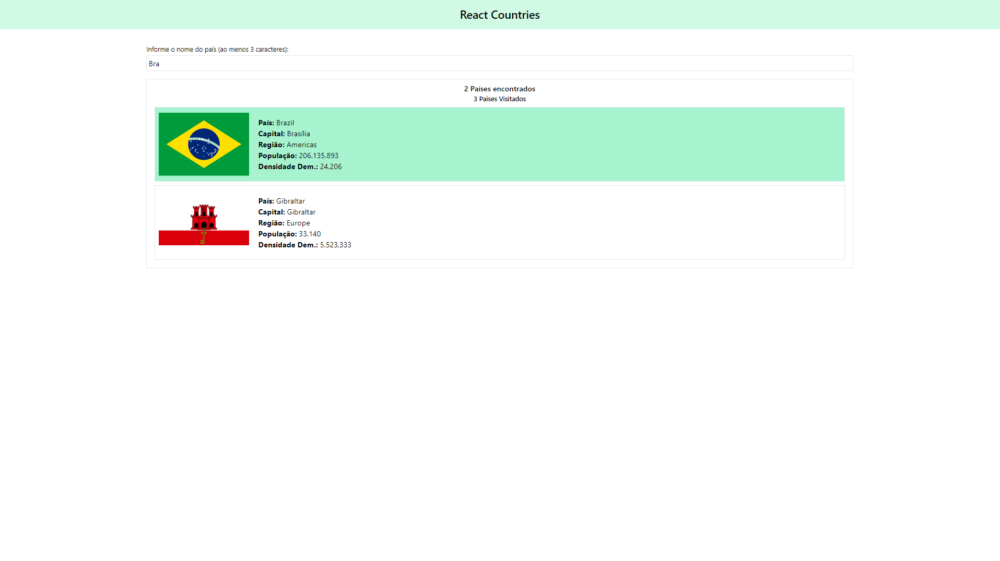

# React Country
Aplicação React para busca de países e seleção de países visitados.

Este é o React Country, uma aplicação desenvolvida com React para busca de países e seleção de países visitados

Este é um prejeto que possui alguns conceitos do React, sendo um dos principais o conceito de Props Drilling 

🚀As principais tecnologias e conceitos utilizados:
<ul>
<li>React</li>
<li>Tailwind CSS - Estilização </li>
<li>Props Drilling</li>
</ul>

 

 

 

